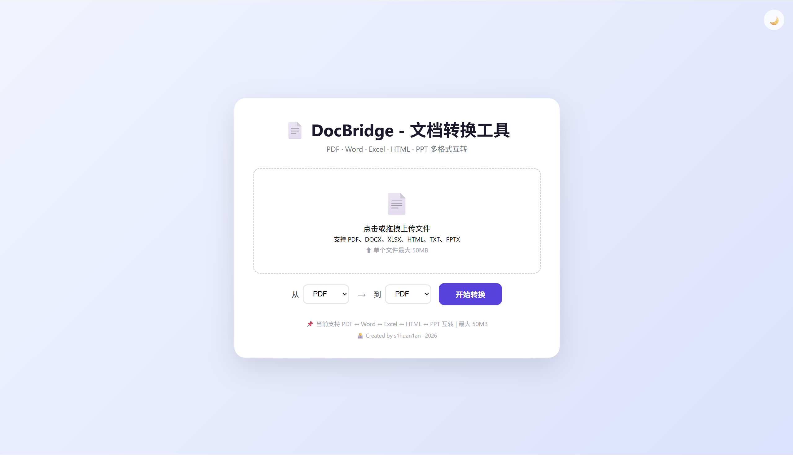
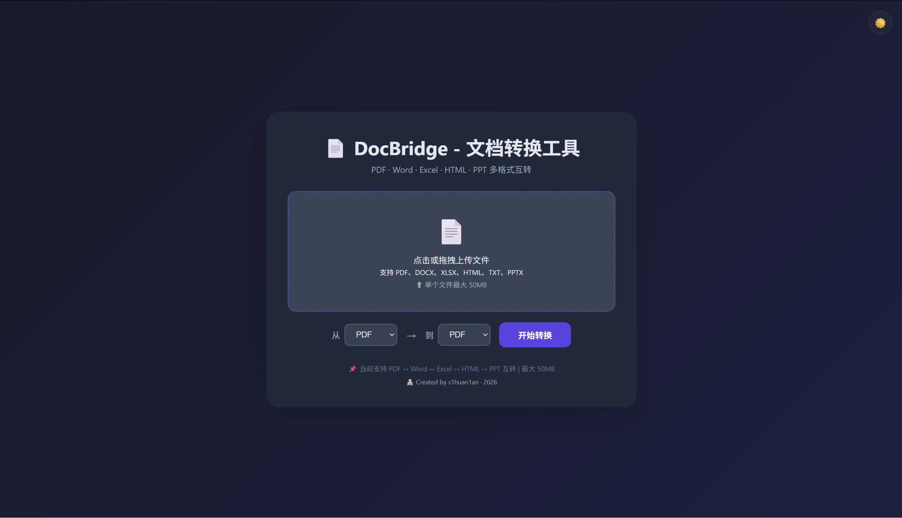

# 📄 DocBridge - 文档转换工具

> 一个基于 Spring Boot 的文档格式转换 Web 应用，支持 PDF、Word、Excel、HTML、PPT 之间的互转。




---

## ✨ 功能特性

- 📄 **Word → PDF**：保留加粗、斜体、下划线、颜色、字号、对齐方式
- 📄 **PDF → Word**：提取文本内容生成 Word
- 📊 **Excel → PDF**：保留表格结构
- 🌐 **HTML ↔ PDF**：支持网页内容转 PDF
- 📽️ **PPT → PDF**：提取幻灯片文本内容
- 🖼️ **Word → PDF 图片支持**：Word 中的图片自动嵌入 PDF
- 📁 **拖拽上传**：支持拖拽文件到上传区域
- 📏 **文件大小限制**：单文件最大 50MB
- 🌙 **深色模式**：支持一键切换深色/浅色主题
- ⏳ **转换进度条**：实时显示转换进度

---

## 🛠️ 技术栈

| 技术 | 用途 |
|------|------|
| Java 17 | 后端开发语言 |
| Spring Boot 3.2.1 | Web 框架 |
| iText 7 | PDF 生成 |
| Apache PDFBox | PDF 解析 |
| Apache POI | Word / Excel / PPT 解析 |
| Thymeleaf | 前端模板引擎 |
| HTML + CSS + JavaScript | 前端界面 |

---

## 🚀 快速开始

### 1. 克隆项目

```bash
git clone https://github.com/cenxuanshen/DocBridge.git
cd DocBridge
